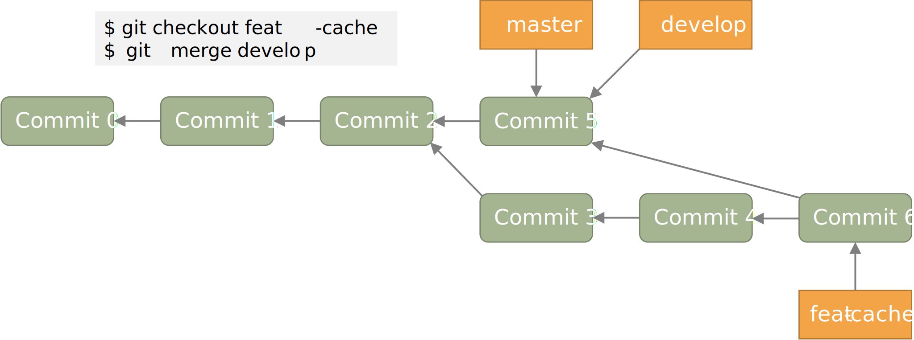
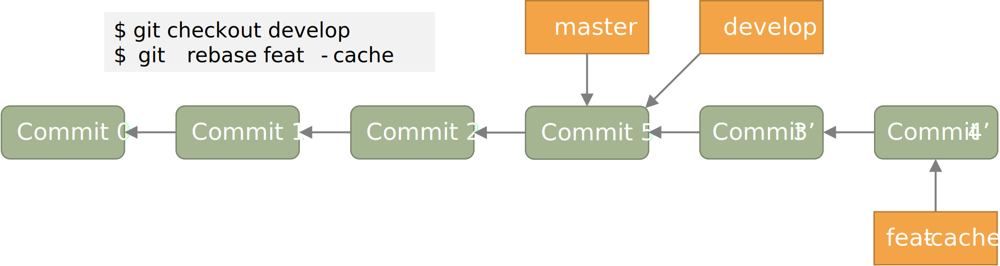

# 进阶操作

读到这里, 你应该已经可以规范地使用 git 来进行开发了. 但是, 你可能会遇到一些让你棘手的问题:

* 提交信息不小心写错了
* 想要将另一个分支的某个文件“复制”到当前分支
* 只想将工作区某文件的一部分修改暂存
* 不小心暂存了不想暂存的文件, 想要取消暂存
* 想要将某个文件还原到最近一次提交的状态
* 撤回一次或多次提交
* 只想合并部分 commit 到另一个分支
* commit 太过零碎, 想要把多个 commit 合为一个, 或是跳过某些 commit

要想简单方便地解决这些问题, 就需要用到一些进阶的操作了.

## 对已有的 commit 进行修改

### 修正最近的一次 commit

如果你发现, 最新的 commit 存在一些错误, 想要对其进行一些修正, 那么只需要将修改好的文件暂存,
然后运行 `git commit --amend` 即可.

但是, 如果你想修改好几次提交之前的错误, 那就只能够先撤回 commit 了.

### 撤回最新的 commit

要撤回最新的 commit, 可以使用 `git reset --hard HEAD^` 命令.

### 撤回连续的多个 commit

如果要撤回多个 commit, 则可以使用 `git reset --hard HEAD~n` 命令, 其中 `n`
代表撤回 commit 的个数.

除此之外, 我们还可以使用 `git rebase -i HEAD~n` 命令来交互式地对之前的 `n` 次 commit
进行修改, 合并, 跳过等操作.

## 合并分支中的部分提交

`git merge` 会将所有的更改都合并到当前分支, 但有时我们只想合并部分 commit 到当前分支.
这种情况下, 我们可以使用 `git cherry-pick` 命令.

通过 `git cherry-pick <commitHash>` 可以将指定提交合并到当前分支,
并在当前分支产生一个新的提交. 当然, 我们也可以一次性合并多个提交, 只需同时指定多个提交即可.

如果想要合并某几个连续的提交到当前分支, 可以执行 `git cherry-pick <commit1>..<commit2>`
命令. `commit 1` 必须早于 `commit 2`, 并且 `commit1` 将不被合并, `commit2` 将被合并.

## 将某分支某文件“复制”到当前分支

`git checkout` 除了可以用于切换分支以外, 还可以用于将某分支的某文件“复制”到当前分支.
只需使用 `git checkout [branch-src] -- <file>` 即可. 

这条命令会将 `branch-src` 分支或提交的 `file` 文件复制到当前工作区之中. 如果省略了
`branch-src` 参数, 则默认指定为当前分支的最近一次提交.

## 暂存某个文件的一部分改动

通过 `git add -p <file>` 可以暂存文件的特定部分. 例如:

```git
$ git add -p playground/sim/src/cpu/csrcs/uart.cpp
diff --git a/playground/sim/src/cpu/csrcs/uart.cpp b/playground/sim/src/cpu/csrcs/uart.cpp
index 4d20a84..7f6caa1 100644
--- a/playground/sim/src/cpu/csrcs/uart.cpp
+++ b/playground/sim/src/cpu/csrcs/uart.cpp
@@ -5,7 +5,26 @@
 #define FIFO_SIZE 1024
 static char fifo[FIFO_SIZE] = {0};
 static short head = 0, tail = 0;
-bool uart_isRunning = false;
+static bool uart_isRunning = false, divisor_latch = false;
+static bool receive_interrupt = false;
+static char scratch = 0;
+
+enum {
+  Receive_Holding  = 0b000,
+  Interrupt_Status = 0b010,
+  Line_Status      = 0b101,
+  Modem_Status     = 0b110,
+  Scratchpad_Read  = 0b111
+}; // READ MODE
+
+enum {
+  Transmit_Holding = 0b000,
+  Interrupt_Enable = 0b001,
+  FIFO_control     = 0b010,
+  Line_Control     = 0b011,
+  Modem_Control    = 0b100,
+  Scratchpad_Write = 0b111
+}; // WRITE MODE

 pthread_t thread_in;
 pthread_mutex_t mutex_fifo_opt = PTHREAD_MUTEX_INITIALIZER;
(1/3) Stage this hunk [y,n,q,a,d,j,J,g,/,e,?]?
```

输入 `?` 可以查看使用帮助:

```git
y - stage this hunk
n - do not stage this hunk
q - quit; do not stage this hunk or any of the remaining ones
a - stage this hunk and all later hunks in the file
d - do not stage this hunk or any of the later hunks in the file
g - select a hunk to go to
/ - search for a hunk matching the given regex
j - leave this hunk undecided, see next undecided hunk
J - leave this hunk undecided, see next hunk
e - manually edit the current hunk
? - print help
```

我们将第一部分暂存, 而跳过剩余的部分, 则最终的效果为:

```git
$ git status
On branch pipeline
Your branch is up to date with 'gitlab/pipeline'.

Changes to be committed:
  (use "git restore --staged <file>..." to unstage)
        modified:   playground/sim/src/cpu/csrcs/uart.cpp

Changes not staged for commit:
  (use "git add <file>..." to update what will be committed)
  (use "git restore <file>..." to discard changes in working directory)
        modified:   playground/sim/src/cpu/AXI_UART.scala
        modified:   playground/sim/src/cpu/csrcs/uart.cpp
        modified:   playground/src/cpu/privileged/CSRs.scala
```

可以看到, 我们仅暂存了该文件的一部分.

## git rebase

`git rebase <branch>` 是一个十分强大的命令, 其使用场景与 `git merge <branch>`
十分类似. 该指令首先会寻找当前分支与 `branch` 分支的最近公共祖先, 之后将当前分支
从该祖先节点开始的所有提交全部移动到 `branch` 分支的顶端.

### git rebase 与 git merge 的区别

为了更清晰地说明这二者的区别, 我们回到之前的例子. 
方便起见, 我们将图重新搬到下面.


执行 `git merge` 后的结果如下图所示:



执行 `git rebase` 后的结果如下图所示:



当然, `git rebase` 还有更多的高级用法, 有兴趣的读者可以进一步了解. 
